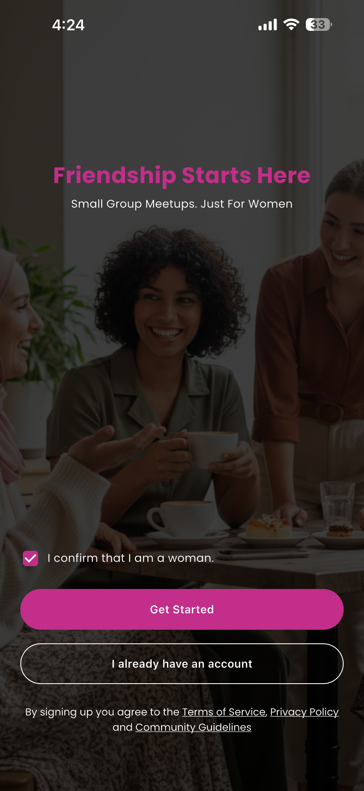
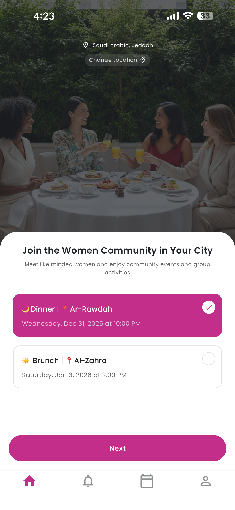
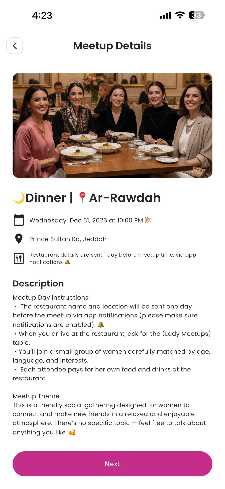
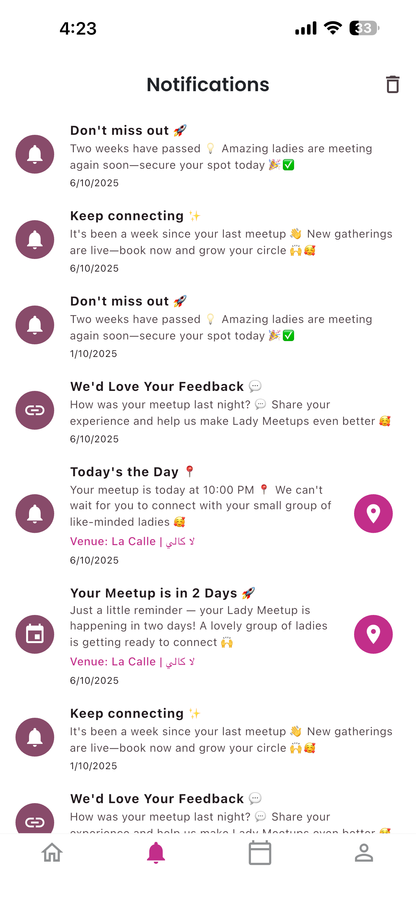

<p align="center">
  
</p>

<h1 align="center">Lady Meetups</h1>

<p align="center">
  <strong>A Women-Only Social Networking Platform for In-Person Meetups</strong>
</p>

<p align="center">
  
  
  
</p>

<p align="center">
  
  
  
</p>

---

## 📖 Overview

**Lady Meetups** is a production-ready social networking mobile application designed exclusively for women. The platform facilitates real-world connections by organizing intimate dining experiences (brunches, dinners) where like-minded women can meet, network, and build lasting friendships in a safe, curated environment.

### 🎯 The Problem

Women often struggle to:

- Meet new friends as adults, especially in new cities
- Find safe, women-only social spaces
- Connect with like-minded individuals who share similar interests
- Build meaningful relationships outside of work or existing social circles

### 💡 The Solution

Lady Meetups provides a complete platform for:

- **Curated Meetups**: Professionally organized dining events at premium venues
- **Smart Matching**: Group attendees by age range, interests, and preferences
- **Subscription Model**: Unlimited meetups with flexible subscription plans
- **Multi-Language Support**: Full English and Arabic with RTL support
- **Multi-Country Expansion**: Location-based events across multiple countries and cities

---

## 📸 Screenshots

<p align="center">
  
  
  
  
</p>

---

## 👨‍💻 My Role & Contributions

As the **Lead Flutter Developer**, I was responsible for:

### Core Development

- 🏗️ **Architected** the entire Flutter application using feature-based modular architecture with GetX
- 📱 **Built** 10+ feature modules from scratch (Auth, Booking, Home, Profile, Notifications, etc.)
- 🌍 **Implemented** comprehensive localization system with Arabic RTL support
- 💳 **Integrated** Stripe subscription payments with preloaded checkout for instant UX

### Technical Challenges Solved

- ⚡ **Instant Checkout**: Built preloaded Stripe WebView system for sub-second payment flow
- 🌐 **Localization**: Implemented dynamic Arabic/English switching with RTL layout support
- 🔔 **Smart Notifications**: Built comprehensive local + push notification system with scheduled reminders
- 📍 **Location Management**: Dynamic country/city/zone hierarchy fetched from Firestore
- 🔒 **Subscription Management**: Built robust subscription validation with booking limits

### Backend & Infrastructure

- ☁️ **Firebase**: Designed Firestore data models, security rules, and Cloud Functions
- 💰 **Stripe Integration**: Created checkout sessions via Cloud Functions with webhook handling
- 📊 **Analytics**: Integrated Adjust, Meta (Facebook), and Firebase Analytics
- 🗺️ **Heatmaps**: Integrated Smartlook for user behavior analysis

### Performance Optimizations

- 🚀 **Preloaded WebViews**: Stripe checkout sessions preloaded for instant payment
- 📦 **Efficient Caching**: Implemented smart caching for events, locations, and user data
- 🔄 **Optimistic UI**: Immediate feedback with background synchronization

---

## 📊 Key Features

### 📱 For Users

| Feature                | Description                                                      |
| ---------------------- | ---------------------------------------------------------------- |
| **Browse Events**      | Discover upcoming meetups in your city and preferred zone        |
| **Smart Booking**      | Set language and dietary preferences for optimal matching        |
| **Subscription Plans** | Choose 1-month or 3-month unlimited meetup subscriptions         |
| **Booking Management** | View upcoming and past bookings with full details                |
| **Venue Details**      | Get venue info, directions via Google Maps 24hrs before event    |
| **Push Notifications** | Reminders at 48hrs, morning of, and post-event feedback requests |
| **Multi-Language**     | Full English and Arabic support with RTL layouts                 |

### 🛠️ For Administrators

| Feature                   | Description                                                  |
| ------------------------- | ------------------------------------------------------------ |
| **Event Management**      | Create events with venues, pricing, and capacity limits      |
| **Location Hierarchy**    | Manage countries → cities → zones dynamically                |
| **User Analytics**        | Track registration funnels, booking behavior, and engagement |
| **Subscription Tracking** | Monitor active subscriptions and revenue metrics             |

---

## 🏗️ Architecture

### System Architecture Diagram

```
┌─────────────────────────────────────────────────────────────────────┐
│                      LADY MEETUPS ARCHITECTURE                      │
├─────────────────────────────────────────────────────────────────────┤
│                                                                     │
│  ┌──────────────┐     ┌──────────────┐                              │
│  │   Flutter    │     │   Flutter    │                              │
│  │     iOS      │     │   Android    │                              │
│  └──────┬───────┘     └──────┬───────┘                              │
│         │                    │                                      │
│         └────────────────────┘                                      │
│                    │                                                │
│         ┌─────────▼─────────┐                                       │
│         │   GetX State      │                                       │
│         │   Management      │                                       │
│         └─────────┬─────────┘                                       │
│                   │                                                 │
│    ┌──────────────┼──────────────┐                                  │
│    │              │              │                                  │
│ ┌──▼─────┐   ┌─────▼─────┐   ┌───▼────────┐                         │
│ │Firebase│   │  Stripe   │   │ Analytics  │                         │
│ │Backend │   │ Payments  │   │  Services  │                         │
│ └──┬─────┘   └───────────┘   └────────────┘                         │
│    │                                                                │
│ ┌──┴─────────────────────────────────────────────────┐              │
│ │ • Firestore (Database)                             │              │
│ │ • Firebase Auth (Email, Google, Apple Sign-In)     │              │
│ │ • Firebase Storage (Profile Images)                │              │
│ │ • Cloud Functions (Stripe Webhooks, Sessions)      │              │
│ │ • Firebase Messaging (Push Notifications)          │              │
│ │ • Firebase Analytics + Adjust + Meta SDK           │              │
│ └────────────────────────────────────────────────────┘              │
│                                                                     │
└─────────────────────────────────────────────────────────────────────┘
```

### Project Structure

```
lib/
├── config/                    # App configuration
├── constants/                 # Colors, text styles, keys, events
│   ├── colors.dart
│   ├── text_styles.dart
│   ├── keys/
│   └── adjust_events.dart
│
├── features/                  # Feature modules (10+ modules)
│   ├── auth/                 # 🔐 Authentication (Email, Google, Apple)
│   │   ├── bindings/
│   │   ├── controllers/
│   │   ├── models/
│   │   └── screens/
│   ├── booking/              # 📅 Event booking & payments
│   │   ├── bindings/
│   │   ├── controllers/
│   │   ├── models/
│   │   ├── screens/
│   │   ├── utils/
│   │   └── widgets/
│   ├── home/                 # 🏠 Home & navigation
│   ├── notifications/        # 🔔 Notification center
│   ├── onboarding/           # 👋 Welcome & profile setup
│   ├── profile/              # 👤 User profile & settings
│   ├── connections/          # 👥 Social connections
│   ├── misc/                 # ❓ FAQs and help
│   └── verification/         # ✓ User verification
│
├── l10n/                     # Localization files
│   ├── app_en.arb           # English translations (700+ strings)
│   ├── app_ar.arb           # Arabic translations (RTL)
│   └── app_localizations.dart
│
├── routes/                   # Navigation routes
├── shared/                   # Shared components & services
│   ├── services/            # Core services (17 services)
│   │   ├── stripe.dart
│   │   ├── local_notifications.dart
│   │   ├── cloud_notifications.dart
│   │   ├── localization_service.dart
│   │   ├── location_service.dart
│   │   └── ...
│   ├── utils/               # Utilities (currency, date, RTL)
│   └── widgets/             # Reusable widgets
│
├── main.dart                # App entry point
├── main_dev.dart            # Development flavor
└── main_prod.dart           # Production flavor
```

### Feature Module Pattern

Each feature follows a consistent, scalable structure:

```
feature/
├── bindings/       # GetX dependency injection
├── controllers/    # Business logic (GetX controllers)
├── models/         # Data models & entities
├── screens/        # UI screens
├── utils/          # Feature utilities
└── widgets/        # Feature-specific widgets
```

---

## 🧩 Technical Challenges & Solutions

### 1. Instant Stripe Checkout Experience

**Challenge**: Stripe WebView checkout caused noticeable delays, hurting conversion rates.

**Solution**: Implemented preloaded checkout sessions:

```dart
// Preload checkout URL in background when user views payment screen
// Multiple sessions preloaded for different subscription plans
StripeService.preloadSubscriptionCheckoutSessions(
  eventId, userId, userEmail, eventName, eventCountry
);

// When user taps "Subscribe" - instant WebView with preloaded URL
Get.to(() => StripeCheckoutScreen(checkoutUrl: preloadedSession['url']));
```

**Result**: Payment screen loads instantly, improving conversion rates significantly.

### 2. Comprehensive Localization with RTL

**Challenge**: Full Arabic support with proper RTL layouts, text, and cultural considerations.

**Solution**:

- Built `LocalizationService` with reactive language switching
- Created `LocalizedDataService` for dynamic content (events, locations)
- Implemented `RTLUtils` for layout direction handling
- 700+ localized strings across the app

**Result**: Seamless Arabic experience with proper RTL layouts throughout.

### 3. Smart Notification System

**Challenge**: Complex notification requirements - registration series, event reminders, post-abandonment recovery.

**Solution**: Built comprehensive notification service with:

- Registration series (Days 1-15 for users without bookings)
- Event notifications (48hrs, morning of, post-event)
- Post-abandonment notifications (2hrs after preferences without payment)
- Post-meetup series (7 & 14 days without new booking)

```dart
// Notifications auto-cancel when conditions change
await cancelPostAbandonmentNotification();  // On successful payment
await cancelRegistrationSeries();           // On first booking
await cancelPostMeetupNotifications();      // On new booking
```

### 4. Dynamic Location Hierarchy

**Challenge**: Support multiple countries with cities and zones, fetched dynamically.

**Solution**: Built `LocationService` that:

- Fetches countries → cities → zones from Firestore
- Caches data with reactive updates
- Provides localized names (English/Arabic)
- Falls back to default data if offline

---

## 🛠️ Tech Stack

### Frontend

| Technology           | Purpose                                |
| -------------------- | -------------------------------------- |
| Flutter 3.5.2        | Cross-platform UI framework            |
| GetX                 | State management, DI, routing          |
| Google Fonts         | Typography (Poppins, Noto Sans Arabic) |
| Cached Network Image | Image caching                          |
| Phone Form Field     | International phone input              |

### Backend & Database

| Technology         | Purpose                               |
| ------------------ | ------------------------------------- |
| Firebase Firestore | Real-time NoSQL database              |
| Firebase Auth      | Authentication (Email, Google, Apple) |
| Firebase Storage   | Profile image storage                 |
| Cloud Functions    | Stripe webhooks, checkout sessions    |
| Firebase Messaging | Push notifications                    |

### Payments & Monetization

| Technology      | Purpose                            |
| --------------- | ---------------------------------- |
| Stripe          | Subscription payments              |
| WebView         | In-app checkout experience         |
| Cloud Functions | Session creation, webhook handling |

### Analytics & Monitoring

| Technology          | Purpose                         |
| ------------------- | ------------------------------- |
| Firebase Analytics  | User behavior tracking          |
| Adjust SDK          | Attribution & campaign tracking |
| Meta (Facebook) SDK | Conversion tracking             |
| Smartlook           | Session recording & heatmaps    |

### Notifications

| Technology                  | Purpose                              |
| --------------------------- | ------------------------------------ |
| Flutter Local Notifications | Scheduled local notifications        |
| Firebase Messaging          | Push notifications                   |
| Timezone                    | Accurate scheduling across timezones |

---

## 🚀 Getting Started

### Prerequisites

- Flutter SDK 3.5.2+
- Xcode 15+ (for iOS)
- Android Studio (for Android)
- Firebase CLI
- CocoaPods (iOS)

### Installation

```bash
# 1. Clone the repository
git clone <repository-url>
cd ladymeetups_app

# 2. Install dependencies
flutter pub get

# 3. iOS setup
cd ios && pod install && cd ..

# 4. Run the app (Development)
flutter run -t lib/main_dev.dart

# 5. Run the app (Production)
flutter run -t lib/main_prod.dart
```

### Build Commands

```bash
# Development Build
flutter run -t lib/main_dev.dart

# Production Build (Android)
flutter build appbundle -t lib/main_prod.dart

# Production Build (iOS)
flutter build ipa -t lib/main_prod.dart
```

---

## 🔐 Security & Best Practices

- ✅ **Environment Variables**: Sensitive keys managed via `envied` package
- ✅ **Firebase Security Rules**: Granular access control on Firestore collections
- ✅ **Input Validation**: Phone number validation, email verification
- ✅ **Secure Payments**: Stripe handles all payment processing (PCI compliant)
- ✅ **ProGuard**: Android code obfuscation enabled
- ✅ **App Transport Security**: Configured for iOS

---

## 🌍 Localization

| Language     | Status                     | RTL Support |
| ------------ | -------------------------- | ----------- |
| English (en) | ✅ Complete (700+ strings) | N/A         |
| Arabic (ar)  | ✅ Complete (700+ strings) | ✅ Full RTL |

### Localization Features

- Dynamic language switching without app restart
- Localized event names, descriptions, and venue details
- Localized currency display based on country
- RTL-aware layouts and text direction
- Localized date and time formatting

---

## 📱 Supported Environments

| Environment | Entry Point          | Purpose                           |
| ----------- | -------------------- | --------------------------------- |
| Development | `lib/main_dev.dart`  | Local testing with debug features |
| Production  | `lib/main_prod.dart` | Live production users             |

---

## 📋 Feature Modules Summary

| Module            | Screens | Controllers | Description                                            |
| ----------------- | ------- | ----------- | ------------------------------------------------------ |
| **Auth**          | 7       | 2           | Sign in, register, email verification, password reset  |
| **Booking**       | 9       | 5           | Event details, preferences, summary, payment, checkout |
| **Home**          | 4 tabs  | 1           | Main navigation, event discovery, bookings, profile    |
| **Notifications** | 1       | 1           | Notification center with read/unread management        |
| **Onboarding**    | 3       | 3           | Welcome, profile setup, interests selection            |
| **Profile**       | 4       | 4           | Profile view/edit, settings, notification preferences  |

---

## 🔮 Future Roadmap

- [ ] In-app messaging between attendees
- [ ] Event photo galleries and memories
- [ ] Referral program with rewards
- [ ] Enhanced matching algorithm
- [ ] Web admin dashboard
- [ ] Additional language support

---

## 📬 Contact

**Muhammad Talha**

- 📧 Email: m.talhaarshad98@gmail.com
- 💼 LinkedIn: [linkedin.com/in/tvlhv](https://linkedin.com/in/tvlhv)
- 🐙 GitHub: [github.com/mtalha101](https://github.com/mtalha101)

---

<p align="center">
  <sub>Built with ❤️ using Flutter</sub>
</p>
